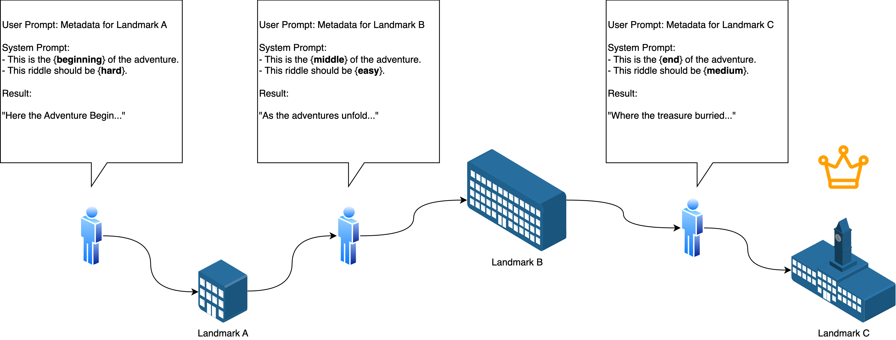
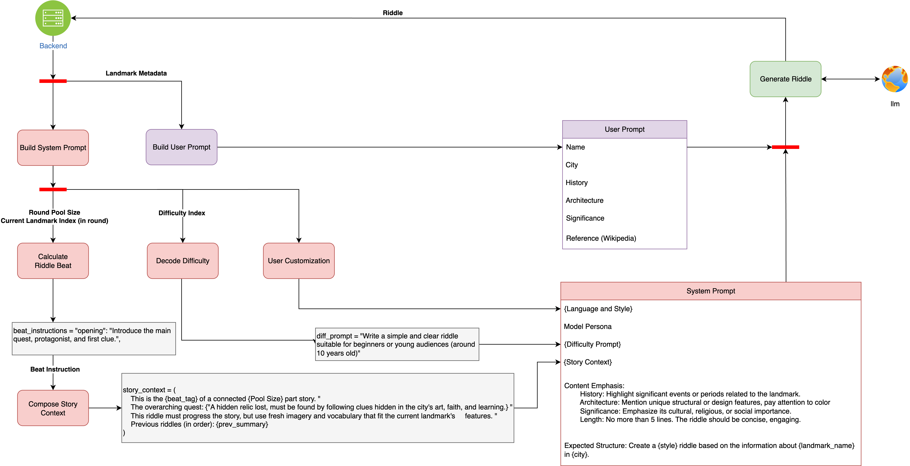

# scavenger.RiddleAgent

## Module Objective



This module provides the real time riddle generation service for main ScavengerHunt back-end based on landmark meta-data.



The riddle_generator.png image illustrates the riddle generation process. Below is a brief explanation of each part shown in the image:
- **Backend**: Retrieves landmark metadata from the backend.
- **Build System Prompt**: Constructs the system prompt, including story background and task information.
- **Build User Prompt**: Constructs the user prompt based on user input and landmark information.
- **Calculate Riddle Beat**: Calculates the riddle beat, determining the rhythm and structure of the riddle.
- **Decode Difficulty**: Decodes the difficulty index, adjusting the complexity of the riddle.
- **User Customization**: Allows user customization options, enabling users to adjust the riddle's style and language.
- **Compose Story Context**: Composes the story context, ensuring the riddle aligns with the overall storyline.
- **Generate Riddle**: Finally generates the riddle, combining system and user prompts.


### Dependencies

Install required Python packages:

```bash
pip install -r requirements.txt
```

**Core dependencies:**
- `Flask==3.1.1` - Web framework for API endpoints
- `pymongo==4.13.2` - MongoDB client for landmark metadata access
- `python-dotenv==1.1.1` - Environment variable management
- `openai==1.97.1` - OpenAI API client (for ChatGPT mode)
- `lmstudio==1.4.1` - LM Studio client (for local LLM mode)

**Note:** The full `requirements.txt` includes all transitive dependencies for reproducible builds.

### Environment Configuration

Create a `.env` file in the project root with:

```bash
# MongoDB Configuration
MONGO_URL=mongodb://localhost:27017
MONGO_DATABASE=scavengerhunt
MONGO_COLLECTION=landmark_metadata

# OpenAI Configuration (for ChatGPT mode)
OPENAI_API_KEY=your_openai_api_key_here

# LM Studio Configuration (for local mode)
LMSTUDIO_BASE_URL=http://localhost:1234/v1
LMSTUDIO_MODEL=llama-3.2-1b-instruct

# Flask Configuration
FLASK_PORT=5001
FLASK_DEBUG=true
FLASK_HOST=0.0.0.0

# Model Selection (local or chatgpt)
DEFAULT_MODEL=local
```

Ensure that the `.env` file is correctly configured with your MongoDB, OpenAI, and LM Studio settings. The Flask application will use these settings to connect to the necessary services and run the server.

### Launch Instructions

1. **Start MongoDB** (if using local instance):
   ```bash
   mongod --dbpath /path/to/your/db
   ```

2. **Start LM Studio** (if using local model):
   - Launch LM Studio application
   - Load `llama-3.2-1b-instruct` model
   - Start local server on `http://localhost:1234`

3. **Activate virtual environment**:
   ```bash
   source .venv/bin/activate
   ```

4. **Start the Flask application**:
   ```bash
   python app.py
   ```

   **Alternative: Use the startup script** (recommended):
   ```bash
   chmod +x start.sh
   ./start.sh
   ```

### API Endpoints

The service runs on **port 5001** by default and provides:

- `POST /generate-riddle` - Generate riddles with story continuity
- `POST /reset-session` - Reset session state

### API Usage Example

```bash
curl -X POST http://localhost:5001/generate-riddle \
  -H "Content-Type: application/json" \
  -d '{
    "sessionId": "unique-session-123",
    "landmarkId": "686fe2fd5513908b37be306d",
    "language": "English",
    "style": "Medieval",
    "difficulty": 50,
    "puzzlePool": ["686fe2fd5513908b37be306d", "686fe2fd5513908b37be306f"]
     }'
```

### Troubleshooting

**Common Issues:**

1. **MongoDB Connection Failed**
   ```
   pymongo.errors.ServerSelectionTimeoutError
   ```
   - Ensure MongoDB is running: `brew services start mongodb-community` (macOS) or `sudo systemctl start mongod` (Linux)
   - Check MongoDB URL in `.env` file
   - Verify database contains `landmark_metadata` collection

2. **LM Studio Connection Failed**
   ```
   lmstudio.exceptions.ConnectionError
   ```
   - Start LM Studio application
   - Load the `llama-3.2-1b-instruct` model
   - Enable local server in LM Studio settings

3. **OpenAI API Errors**
   ```
   openai.error.AuthenticationError
   ```
   - Verify `OPENAI_API_KEY` in `.env` file
   - Check API key permissions and billing status

4. **Port Already in Use**
   ```
   OSError: [Errno 48] Address already in use
   ```
   - Change port in `app.py`: `app.run(port=5002)`
   - Kill existing process: `lsof -ti:5001 | xargs kill -9`

5. **Missing Dependencies**
   ```
   ModuleNotFoundError: No module named 'flask'
   ```
   - Activate virtual environment: `source .venv/bin/activate`
   - Install dependencies: `pip install -r requirements.txt`

---

## Dev Log

### Jun. 2 2025
#### Generation Layer - Local LLM-Based Riddle Production

- Implemented a standalone `RiddleGenerator` class that loads metadata from the `landmark_metadata` MongoDB collection and generates riddles using a local `llama-3.2-1b-instruct` model.
    
- The class accesses the following fields from the landmark entry:
    - `name`
    - `meta.description.history`      
    - `meta.description.architecture`       
    - `meta.description.significance`
        
- These fields are used to construct a user prompt formatted as bullet-pointed sections.  
- A custom system prompt is generated based on the riddle style (e.g. _medieval_) and language (default: _English_), following the LM Studio chat template format.
    

```python
# Template-based prompt generation
template = """<|begin_of_text|><|start_header_id|>system<|end_header_id|>
{system}
<|eot_id|><|start_header_id|>user<|end_header_id|>
{user}
<|eot_id|><|start_header_id|>assistant<|end_header_id|>"""

system_prompt = f"""
You are a master riddle writer. Writing only riddles for landmark in following format with no extra information nor specifying landmark name.
\\begin{{quote}}
Written in {language}
Create a {style} riddle based on the information about {self.meta["name"]}. Use the following details as context:
\\textbf{{History}}: ...
\\textbf{{Architecture}}: ...
\\textbf{{Significance}}: ...
\\textbf{{Length}}: No more than 5 lines.
The riddle should be concise, engaging, and reflect a {style} tone.
\\end{{quote}}
"""
```
- The generated riddle is stored in the instance variable `.riddle` and returned to the calling layer.   

#### API Layer - Flask-Based Microservice Integration

- Created `app.py` as a lightweight HTTP wrapper around the `RiddleGenerator` class. 
- Exposed a single POST route `/generate-riddle`, which:  
    - Accepts a JSON payload containing `landmarkId`   
    - Loads metadata from MongoDB  
    - Runs the local LLM model to produce a riddle  
    - Returns a JSON response with the generated riddle

```python
@app.route("/generate-riddle", methods=["POST"])
def generate_riddle():
    data = request.get_json()
    lm_id = data.get("landmarkId")
    generator = RiddleGenerator()
    generator.loadMetaFromDB(lm_id).generateRiddle()
    return jsonify({
        "status": "ok",
        "riddle": generator.riddle
    })
```

- Startup instructions:
    
    ```bash
    source .venv/bin/activate
    python app.py
    ```

#### Output Format - Direct Riddle JSON

The riddle API produces a JSON object suitable for direct consumption by frontend or game clients:

```json
{
  "status": "ok",
  "riddle": "Through storms I stood with graceful art,\nThree floors deep I hold your heart..."
}
```

#### Error Handling

- If the `landmarkId` is missing or not found, appropriate HTTP status codes (400 / 404) can be returned (recommended for future versions).
- If `description` metadata is empty or missing, the response defaults to:
    ```text
    "No riddle generated"
    ```

#### Design Notes: Standalone Agent Layer

This module introduces a clean separation of concerns:

- **Metadata access** is encapsulated in `loadMetaFromDB()` 
- **Prompt formatting** and content construction are embedded in `generateRiddle()`  
- **LLM integration** is abstracted behind `lmstudio.llm(...)` 
- **Microservice interface** via Flask enables easy orchestration from Java or frontend

This architecture supports future enhancements such as multilingual riddles, user-personalized difficulty, or caching of outputs.

---

### Jun. 14 2025

#### Epistemic Layer - Initial Planning Integration

* Introduced two foundational classes:

  * `EpistemicStateManager`: models player knowledge by tracking solved landmark IDs and extracting semantic themes.
  * `EpistemicPlanner`: evaluates the novelty of a landmark by comparing its metadata to the player's known types and topics.

* The planner returns a JSON object indicating:

  * `difficulty`: (easy / medium / hard)
  * `novelty_score`: continuous value between 0 and 1
  * Optional `hint` for unfamiliar keywords

* Current logic uses keyword overlap between landmark metadata and player history as a proxy for familiarity.

* Discussed with supervisor the potential to integrate an **ELO-based difficulty control system**, where:

  * Each landmark is assigned a difficulty rating.
  * EpistemicPlanner can combine player state and ELO gap to estimate challenge level.

#### Design Implication

* Landmark difficulty should be **explicitly stored or inferred dynamically**.
* Epistemic reasoning can then adaptively personalize riddles based on player proficiency and landmark complexity.

---

### Jun. 19 2025

#### Scoring Layer - ELO Difficulty Modeling (Under Development)

* Created initial prototype in `elo_calculator_demo.py` to simulate adaptive scoring based on player-landmark interaction.

This module serves as a testing sandbox for game balancing and numerical behavior visualization. The final production version will be fully integrated into the main Spring Boot application as part of the core game logic.

* Implemented key components:

  * `calculateElo(player, landmark, minutes_used, correct)`: updates rating for both player and landmark using modified ELO logic based on High-Speed High-Stakes (HSHS) scoring.

  * `_dynamicK(player, landmark)`: computes K-factors using Glickman-style uncertainty terms (`U_player`, `U_landmark`).

  * `_updateUncertainty(current_U, days_since_last_play)`: increases uncertainty over time; stabilizes with repeated play.

  * `_hshs(...)`: defines time-sensitive scoring function incorporating response correctness and time efficiency; computes expected score analytically using discrimination-adjusted logistic model.

* Notes:

  * Initial ratings default to 10; uncertainty defaults to 0.5.
  * All values are clamped to \[0,1] for stability and interpretability.
  * Current implementation serves as testbed; not yet connected to main session state or database.

* Planned integration:

  * `PuzzleManager`: to support difficulty-based target selection.
  * `EpistemicPlanner`: to leverage uncertainty in knowledge tracking and goal planning.

---

### Aug. 11 2025

#### **Step 1 - Extend RiddleGenerator with story\_context Support**

**Objective**: Enable the generator to accept `story_context` (including beat\_tag and previous\_riddles) and use it in the prompt.

**Current State**:

* `generateRiddle()` already supports `story_context` parameter:

```python
def generateRiddle(self, language="English", style="medieval", difficulty=50, story_context=None):
```

* `_generateSystemPrompt()` has been added:

```python
if isinstance(story_context, str) and story_context.strip():
    context_prompt = f" following the ongoing story context: {story_context.strip()}"
else:
    context_prompt = "."
```

* backward-compatible: when `story_context` is None, follows original logic.

**Next Action**:

* Enhance the prompt guidance of story\_context (explicitly require continuation of previous text and plot progression).

---

#### **Step 2 - Implement StoryWeaver as Session Manager**

**Objective**: Manage the multi-riddle story progress of a game session, maintain context internally, and keep the API as a single `/generate-riddle` endpoint.

**Current State**:

* Memory structure:

```python
self.sessions[session_id] = {
    "total_slots": len(puzzle_pool),
    "slot_index": 0,
    "beat_plan": [...],
    "riddle_history": [],
    "puzzle_pool": puzzle_pool
}
```

* `start_episode()`:

  * If `session_id` does not exist → create new
  * If exists → reuse
  * Return `session_id`
* `serve_riddle()`:

  * Get current beat\_tag and previous\_riddles
  * Generate story\_context (natural language)
  * Call `RiddleGenerator.generateRiddle()`
  * Save to riddle\_history, slot\_index++


#### **Step 3 - API Integration**

**Objective**: Complete new game & continuation logic with a single `/generate-riddle` interface.

**Current State**:

```python
@app.route("/generate-riddle", methods=["POST"])
def generate_riddle():
    session_id = story_weaver.start_episode(puzzle_pool, session_id_from_client)
    riddle_info = story_weaver.serve_riddle(language, style, difficulty, session_id)
    return jsonify({
        "status": "ok",
        "session_id": session_id,
        "riddle": riddle_info["riddle"]
    })
```

* First call passes `puzzle_pool` (can contain multiple landmarkIds), returns first riddle + `session_id`
* Subsequent calls only pass `session_id` → StoryWeaver automatically generates next riddle


#### **Step 4 - Testing & Validation**

**Test Sequence with 3 Landmark IDs**:

```
686fe2fd5513908b37be306d  → Glucksman Gallery
686fe2fd5513908b37be306f  → Honan Collegiate Chapel
686fe2fd5513908b37be3071  → The Quad / Aula Maxima
```

##### **Round 1**

**Beat Tag**: opening
**Riddle**:

```
In a land where scholars tread, a fortress of art stands proud and wed,
By architects' hands, it claimed its fame, with awards and honors to its name.
Thrice-leveled tower, cloaked in praise, where modern muses spend their days.
Baptized by a president, its walls have seen, floods and closures, yet its spirit's keen.
What is this beacon by the college green?
```

**Answer**: Glucksman Gallery

---

**Beat Tag**: development
**Riddle**:

```
In a land where saints and scholars once did dwell,
A chapel stands, her tales of faith to tell.
With walls enrobed in Celtic art's embrace,
Her glass stained windows saints in light do trace.
Built not from tithe but from a maiden's grace.
```

**Answer**: Honan Collegiate Chapel

---

**Beat Tag**: ending
**Riddle**:

```
In a realm where wisdom's flame is fed,
A Gothic guardian stands, its spires point high;
Limestone bones clad in academic pride,
Where scholars gather, and young minds are led.
Behold, where history and learning wed.
```

**Answer**: The Quad / Aula Maxima

---

**Observations**

* The sequence of three riddles is correct, but the story context connection is not strong
* Need to enhance prompt guidance for "continuing previous text and advancing plot"
* Future additions to story\_context could include:

  * Global motif
  * Narrative supplementary explanations corresponding to beat\_tag
  * Important elements from previous riddle (link\_to)

---

##### **Round 2**

**Code Changes**

* Added new `story_context` construction logic in `serve_riddle()`, including:

  * **Global story seed** (`state['story_seed']`)
  * **Narrative function descriptions corresponding to beat\_tag** (opening / development / ending)
  * Explicit requirement to "use current landmark's characteristics for completely new descriptions" to avoid repetitive wording
  * Retain `Previous riddles` summary for context continuation
* In `_generateSystemPrompt()` directly use the passed `story_context`, remove redundant `context_prompt` variable, ensure narrative arc information is maintained in one centralized place
* This way the first riddle will introduce the main quest, subsequent riddles will reference and advance the quest plot, while maintaining fresh wording and imagery

---

**Beat Tag**: opening
**Riddle**:

```
In a land where saints and scholars once did dwell,
A chapel stands, her tales of faith to tell.
With walls enrobed in Celtic art's embrace,
Her glass stained windows saints in light do trace.
Built not from tithe but from a maiden's grace.
```

**Answer**: Glucksman Gallery

---

**Beat Tag**: development
**Riddle**:

```
Beneath the gaze of saints in glass arrayed,
Where Celtic knots and Romanesque embrace,
The mosaic floor, with zodiac displayed,
Holds the next clue, a celestial trace.
Seek where the sun meets stars in morning's grace.
```

**Answer**: Honan Collegiate Chapel

---

**Beat Tag**: ending
**Riddle**:

```
In spires that pierce the sky with Gothic grace,
Where limestone towers guard learned lore's place,
Beneath arches pointed as scholars' thought,
Here lies the relic, by keen minds long sought.
In halls of echoes, past whispers the truth.
```

**Answer**: The Quad / Aula Maxima

**Observations**

The sequence of three riddles matches beat_tag, plot structure follows opening → development → ending rhythm

Continuity improved compared to previous: all three riddles revolve around the same type of background (academic, artistic, religious) and maintain a consistent story atmosphere

Diversified wording, no rigid repetition of previous riddle's phrasing, but core imagery (knowledge, faith, art) is preserved

Can be further optimized:

In opening, directly embed "quest motivation" or "core artifact" to add suspense

In development, introduce plot twists or unexpected clues to increase tension

In ending, clearly reveal quest conclusion to enhance sense of completion


### Sept. 26 2025

**Objective**: Containerize PuzzleAgent and perform end-to-end verification of MongoDB communication and health status on the local machine using runtime configuration injection.

#### Completed

- **Dockerfile and Image**: Created Dockerfile based on `python:3.12-slim` and built image: `puzzle-agent:local`
- **Runtime Configuration**: Used `.env` for runtime configuration injection (`.env` not committed to protect secrets)
- **Network Integration**: Established local container network and connected existing MongoDB container (container name: `mongo`). PuzzleAgent accesses MongoDB via container name resolution: `MONGO_URL=mongodb://mongo:27017`
- **Port Mapping**: Mapped ports using `-p 5001:5000`. Flask listens on `0.0.0.0:5000`; external access via `localhost:5001`
- **Health Check**: `curl -X POST http://localhost:5001/health` returns `{"status":"healthy", ...}` (timestamp: 2025-09-26T18:43:07Z)

#### Conclusion

✅ **Image**: Dependencies installed, entry script, and exposed ports working correctly  
✅ **Runtime Configuration**: Configuration injection works (no `OPENAI_API_KEY` baked into image)  
✅ **Inter-container Network**: Communication via service name instead of localhost

#### Pending Tasks / Risks

- **LandmarkProcessor**: Not yet containerized; needs port strategy and health check interface alignment
- **Backend Configuration**: Microservice base URLs need to be configurable for switching between "local direct run" and "Compose/deployment" environments
- **LM Studio Access**: If LM Studio runs on host, container access requires `host.docker.internal` (Linux may need manual add-host)

#### Next Steps (Minimum Action List)

**1. LandmarkProcessor Containerization and Integration**
- Build image with same approach (suggest internal port 5000)
- Run mapping: `-p 5002:5000` (avoid conflict with 5001)
- Inject `.env.container` (Mongo: `mongodb://mongo:27017`; LM Studio/OPENAI same as PuzzleAgent)
- Verify: `curl http://localhost:5002/health` should return 200

**2. Backend Configuration Switching (Prepare for Compose)**
- **Local Direct Run**: `PUZZLE_AGENT_URL=http://127.0.0.1:5001`, `LANDMARK_PROCESSOR_URL=http://127.0.0.1:5002`, `MONGODB_URI=mongodb://127.0.0.1:27017/...`
- **Compose/Deployment**: `http://puzzle-agent:5000`, `http://landmark-processor:5000`, `mongodb://mongo:27017/...`

**3. End-to-End Chain Verification**
- Frontend → Backend `/api/...` → Two microservices → MongoDB

**4. HTTPS External Access Verification**
- Start backend (listen on `0.0.0.0:8080`)
- Run: `ngrok http 8080`
- Use mobile device to open ngrok HTTPS link, verify frontend and `/api` full flow

**5. Deployment Repository Setup**
- Create `docker-compose.yml` in deployment repository (use `image:` only, no `build:`)
- Prepare `.env.template` (for deployer to fill `OPENAI_API_KEY`)
- Optional script: `docker compose pull && docker compose up -d`, print ngrok link
